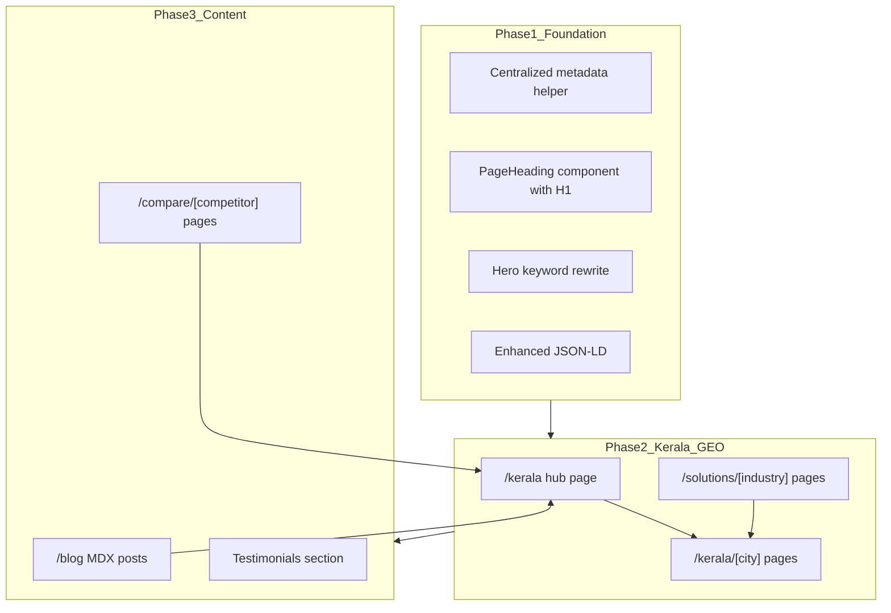

# Delivero Full SEO Implementation (Kerala-First)

> Implementation plan based on the SEO Gap Analysis + GEO Targeting Report.  
> **Primary market:** Kerala, India.

## Checklist

- [x] Create `src/lib/seo.ts`, fix H1 hierarchy, update Hero/layout metadata with category keywords and Kerala positioning
- [x] Add gap keywords to features/pricing/home copy, INR pricing, Offer schema, nav/footer links to Pricing and new sections
- [ ] Build content data + `/kerala` hub + `/kerala/[city]` dynamic routes for 8 Kerala cities
- [ ] Build `/solutions/[industry]` pages for milk, bakery, grocery, water, tiffin, meal delivery
- [ ] Set up MDX blog infrastructure and publish 5 Kerala-targeted posts
- [ ] Create Delivero vs TrakOp/MilkRide/Rekart comparison pages and wire testimonials on home
- [ ] Expand sitemap for all new routes; add BreadcrumbList, Article, and enhanced SoftwareApplication schema

---

## Current state

The site is a lean Next.js 16 App Router marketing site with 8 routes, baseline metadata/sitemap/robots, and `SoftwareApplication` JSON-LD in [`src/app/layout.tsx`](../src/app/layout.tsx). Key gaps vs. the audit:

- H1 only on home ([`src/components/Hero.tsx`](../src/components/Hero.tsx)); inner pages use `<h2>` via [`src/components/Section.tsx`](../src/components/Section.tsx)
- No Kerala/India geo signals anywhere
- Use cases live as home sections only ([`src/app/page.tsx`](../src/app/page.tsx) `#use-cases`) — not indexable URLs
- `/pricing` exists but is thin, USD-priced, and not linked in [`src/components/NavBar.tsx`](../src/components/NavBar.tsx)
- No blog, comparison, industry, or city landing pages
- [`src/components/ClientCarousel.tsx`](../src/components/ClientCarousel.tsx) exists but is unused (placeholder testimonials)



---

## Phase 1 — Foundation and quick keyword wins

### 1.1 Shared SEO utilities

Create [`src/lib/seo.ts`](../src/lib/seo.ts) with:

- `buildMetadata({ title, description, path, keywords?, openGraph? })` — consistent titles (≤60 chars), descriptions (≤155 chars), canonicals, OG/Twitter
- `buildBreadcrumbJsonLd(items)` helper
- Expanded default `keywords` array covering high-priority gap terms: `delivery management software`, `last mile delivery software`, `route optimization software`, `subscription delivery management`, `milk delivery software`, `proof of delivery app`, etc.

Update [`src/app/layout.tsx`](../src/app/layout.tsx) root metadata to lead with category keyword:

- **Title:** `Delivero – Delivery Management Software for Kerala`
- **Description:** Kerala-focused, mentions last-mile, routes, drivers, subscription/daily deliveries

### 1.2 Fix heading hierarchy sitewide

Extend [`src/components/Section.tsx`](../src/components/Section.tsx) with optional `as="h1"` (or add a thin `PageHero` component) so every page has exactly one H1.

| Page | Proposed H1 |
|------|-------------|
| Home | Delivery management software for Kerala businesses |
| Features | Last-mile delivery & route management features |
| Pricing | Delivery management software pricing |
| FAQ | Delivery software FAQ |
| Contact | Contact Delivero |
| Screenshots | See Delivero in action |

Update [`src/components/Hero.tsx`](../src/components/Hero.tsx):

- **H1:** `Delivery management software for Kerala businesses`
- **Subcopy:** weave in `last mile delivery`, `route optimization`, `subscription delivery`, `proof of delivery`, `driver app`
- Badge: `Built for Kerala's daily delivery businesses`

### 1.3 Enrich existing pages with gap keywords

**[`src/app/features/page.tsx`](../src/app/features/page.tsx)** — add 3 new `FeatureCard`s:

- Last-mile delivery tracking
- Route optimization & driver assignment
- Proof of delivery & order status updates

**[`src/app/pricing/page.tsx`](../src/app/pricing/page.tsx)**:

- Keyword-rich metadata: `Delivero pricing – delivery management software for small business`
- Add INR pricing alongside or instead of USD (₹0 / ₹3,999/mo / Custom — aligned to Kerala SMB market)
- Add `Offer`/`AggregateOffer` JSON-LD for rich results
- Add pricing FAQ targeting `how much does delivery software cost`

**[`src/app/page.tsx`](../src/app/page.tsx)** — strengthen home copy:

- Problem section: mention `replace spreadsheets` long-tail
- Use-case cards: rename to keyword phrases (`Milk delivery software`, `Bakery delivery software`, etc.) with Kerala context in descriptions
- Add testimonials section using real or clearly labeled placeholder quotes (Kerala city + business type)

### 1.4 Schema enhancements

In [`src/app/layout.tsx`](../src/app/layout.tsx), expand `SoftwareApplication` with:

- `description`, `featureList`, `applicationSubCategory`, `offers` (link to pricing)
- `areaServed: { "@type": "State", name: "Kerala" }`

Add `BreadcrumbList` to inner pages via shared layout pattern.

### 1.5 Navigation and internal linking

Update [`src/components/NavBar.tsx`](../src/components/NavBar.tsx) and [`src/components/Footer.tsx`](../src/components/Footer.tsx):

- Add **Pricing**, **Solutions**, **Kerala**, **Blog** links
- Footer column: Solutions (milk, bakery, grocery), Kerala cities, Compare

---

## Phase 2 — Kerala GEO and industry landing pages

Kerala-first URL structure that scales without duplicating layout code.

### 2.1 Data-driven content model

Create [`src/content/kerala/cities.ts`](../src/content/kerala/cities.ts):

| Slug | City | Priority | Local angle |
|------|------|----------|-------------|
| `kochi` | Kochi / Ernakulam | P0 | Urban delivery hub, bakeries, groceries |
| `thiruvananthapuram` | Thiruvananthapuram | P0 | Capital, milk/tiffin subscriptions |
| `kozhikode` | Kozhikode | P1 | Grocery & meal delivery |
| `thrissur` | Thrissur | P1 | Bakery & festival-order spikes |
| `kollam` | Kollam | P2 | Water & essentials distribution |
| `kannur` | Kannur | P2 | Local distributor networks |
| `kottayam` | Kottayam | P2 | Milk/cooperative delivery |
| `palakkad` | Palakkad | P2 | Tier-2 grocery & essentials |

Create [`src/content/solutions/industries.ts`](../src/content/solutions/industries.ts):

| Slug | Title | Primary keywords |
|------|-------|------------------|
| `milk-delivery` | Milk delivery software | milk delivery app, subscription delivery management, dairy delivery |
| `bakery-delivery` | Bakery delivery software | bakery delivery app, morning route delivery |
| `grocery-delivery` | Grocery delivery management | grocery distribution, local delivery management |
| `water-delivery` | Water delivery management app | water supply runs, can delivery |
| `tiffin-delivery` | Tiffin delivery management | meal delivery, daily tiffin routes |
| `meal-delivery` | Meal delivery software | recurring meal orders |

Each entry stores: `title`, `metaDescription`, `h1`, `intro`, `painPoints[]`, `features[]`, `relatedCities[]`, `ctaText`.

### 2.2 Route structure

```
/kerala                          → Kerala hub (state-level landing)
/kerala/[city]                   → City landing pages (8 cities)
/solutions/[industry]            → Industry pages (6 verticals)
/solutions/[industry]/kerala/[city]  → Optional combo pages for top 3 city×industry pairs (Phase 2b)
```

**Shared template:** [`src/components/landing/LandingPage.tsx`](../src/components/landing/LandingPage.tsx) — hero H1, local intro, feature grid, use-case bullets, FAQ (3–4 city/industry-specific Qs), CTA band, breadcrumb.

**Example target URLs and titles:**

- `/kerala` — *Delivery Management Software for Kerala*
- `/kerala/kochi` — *Delivery App for Small Business in Kochi*
- `/solutions/milk-delivery` — *Milk Delivery Software for Kerala*
- `/solutions/milk-delivery/kerala/kochi` — *Milk Delivery App for Business in Kochi* (combo, high-intent)

### 2.3 Kerala hub page content

[`src/app/kerala/page.tsx`](../src/app/kerala/page.tsx) should include:

- State-level H1 with primary category keyword
- Grid linking to all city pages
- Grid linking to all industry solutions
- Copy emphasizing Kerala's daily-delivery economy (milk cooperatives, bakeries, tiffin, kirana)
- "Serving delivery businesses across Kerala" (not fake addresses)

### 2.4 Dynamic metadata

Use `generateMetadata` on dynamic routes reading from content data files — each page gets unique title, description, canonical, and OG tags.

### 2.5 Sitemap expansion

Update [`src/app/sitemap.ts`](../src/app/sitemap.ts) to programmatically include all Kerala, solution, blog, and compare routes. Set city hub priority `0.8`, combo pages `0.6`.

---

## Phase 3 — Blog (MDX in repo)

MDX files in repo (no CMS dependency). Add `@next/mdx` or `next-mdx-remote` + `gray-matter`.

```
src/content/blog/
  milk-delivery-software-kerala.mdx
  replace-spreadsheets-delivery-management.mdx
  bakery-delivery-app-kerala.mdx
  last-mile-delivery-small-business-kerala.mdx
  delivery-management-software-cost-india.mdx
```

Routes:

- [`src/app/blog/page.tsx`](../src/app/blog/page.tsx) — index with post cards
- [`src/app/blog/[slug]/page.tsx`](../src/app/blog/[slug]/page.tsx) — article with `Article` JSON-LD

Each post targets 1–2 gap keywords, links to relevant `/kerala/[city]` and `/solutions/[industry]` pages, and includes a CTA to `/contact` or `/pricing`.

---

## Phase 4 — Competitor comparison pages

Create [`src/content/compare/competitors.ts`](../src/content/compare/competitors.ts) and route [`src/app/compare/[slug]/page.tsx`](../src/app/compare/[slug]/page.tsx):

| Slug | Page |
|------|------|
| `trakop` | Delivero vs TrakOp |
| `milkride` | Delivero vs MilkRide |
| `rekart` | Delivero vs Rekart |

Template sections: overview, feature comparison table, pricing philosophy, why Delivero for Kerala SMBs, honest "when competitor may fit" paragraph, CTA.

**Tone:** factual, not disparaging — compare on simplicity, Kerala/local SMB fit, pricing transparency.

Metadata targets: `Delivero vs TrakOp`, `delivery management software comparison Kerala`.

---

## Phase 5 — Trust, pricing, and off-site SEO

### 5.1 Testimonials

Wire [`src/components/ClientCarousel.tsx`](../src/components/ClientCarousel.tsx) into home (or replace with a simpler quote grid) using structured testimonial data in [`src/content/testimonials.ts`](../src/content/testimonials.ts). Each entry: quote, name, business type, Kerala city.

### 5.2 Google Play ASO (manual, out of repo)

Recommended Play Store listing updates:

- Title: `Delivero – Delivery Management & Driver App`
- Short description: keywords `delivery management`, `route tracking`, `driver app`, `Kerala`
- Full description: mirror site gap keywords

### 5.3 Analytics (optional but recommended)

Add Vercel Analytics or Google Search Console verification meta tag in layout for measuring Kerala keyword traction post-launch.

---

## Implementation order (recommended PR sequence)

1. **PR 1 — Foundation:** `seo.ts`, H1 fix, Hero/metadata/keywords, features/pricing copy, nav/footer, schema
2. **PR 2 — Kerala GEO:** content data + `/kerala` hub + 8 city pages + sitemap
3. **PR 3 — Solutions:** 6 industry pages + cross-links from home use cases
4. **PR 4 — Blog:** MDX setup + 5 Kerala-targeted posts
5. **PR 5 — Compare + testimonials:** 3 comparison pages + home testimonials

---

## Key files to create/modify

| Action | Path |
|--------|------|
| Create | `src/lib/seo.ts` |
| Create | `src/content/kerala/cities.ts` |
| Create | `src/content/solutions/industries.ts` |
| Create | `src/content/compare/competitors.ts` |
| Create | `src/content/blog/*.mdx` (5 posts) |
| Create | `src/components/landing/LandingPage.tsx` |
| Create | `src/app/kerala/page.tsx`, `src/app/kerala/[city]/page.tsx` |
| Create | `src/app/solutions/[industry]/page.tsx` |
| Create | `src/app/blog/page.tsx`, `src/app/blog/[slug]/page.tsx` |
| Create | `src/app/compare/[slug]/page.tsx` |
| Modify | `src/components/Hero.tsx`, `Section.tsx`, `NavBar.tsx`, `Footer.tsx` |
| Modify | `src/app/layout.tsx`, `page.tsx`, `features/page.tsx`, `pricing/page.tsx` |
| Modify | `src/app/sitemap.ts` |

---

## Success criteria

- Every indexable page has unique title, meta description, canonical, one H1, and breadcrumb schema
- 15+ new indexable URLs targeting Kerala + industry keywords
- Home and features pages mention all high-priority gap keywords naturally
- Internal link graph: Home → Kerala hub → cities/solutions → blog/compare → contact/pricing
- Sitemap includes all new routes
- No duplicate thin content — city/industry pages differ via data-driven unique intros and FAQs
